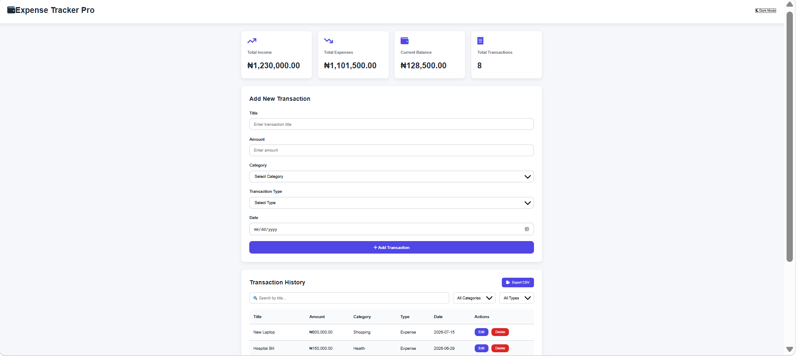
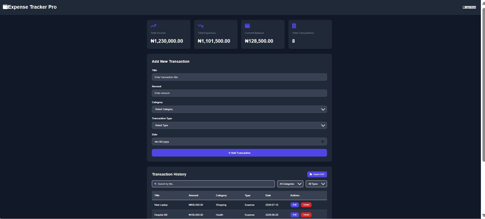
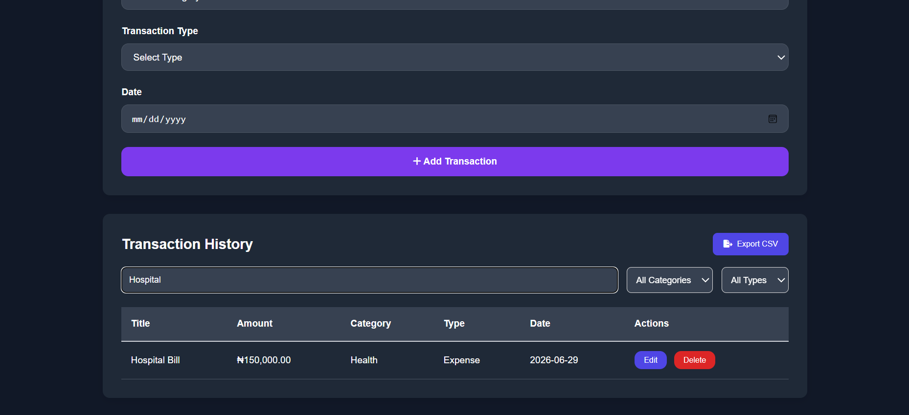
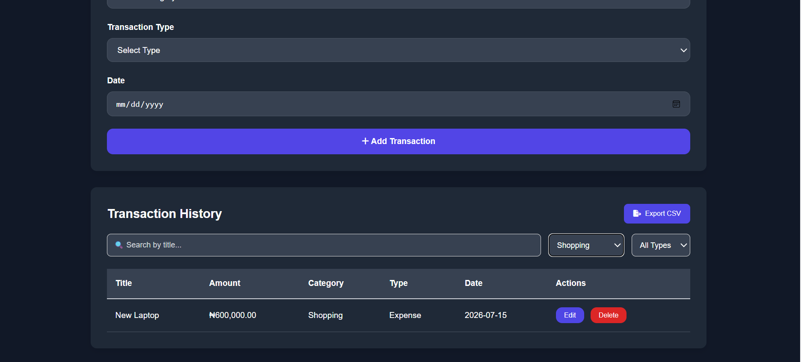
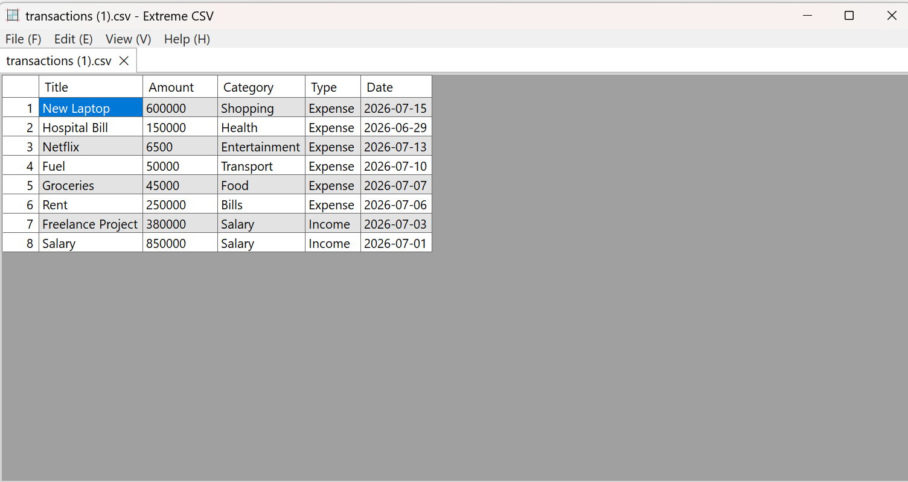
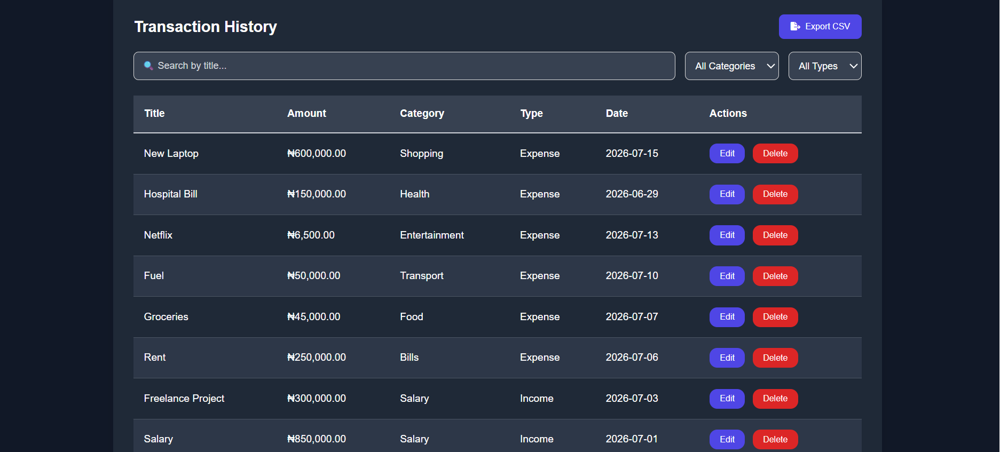
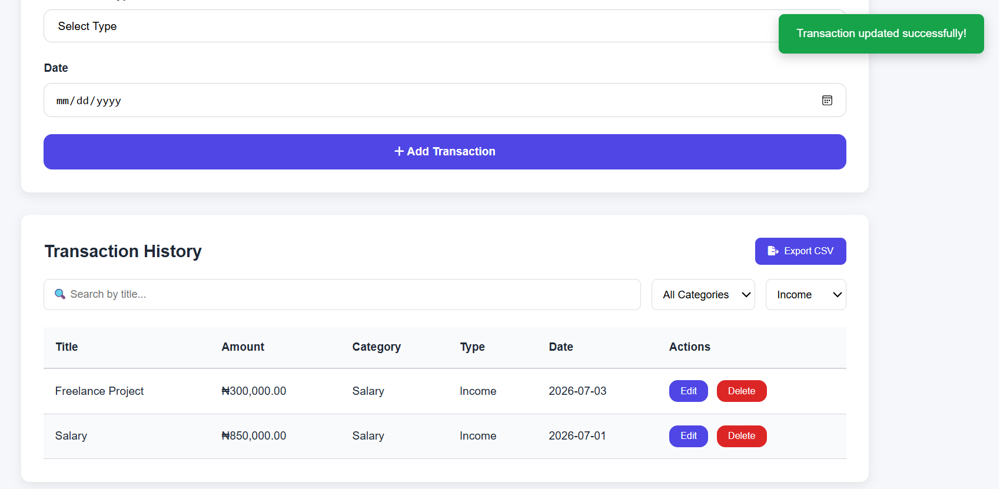
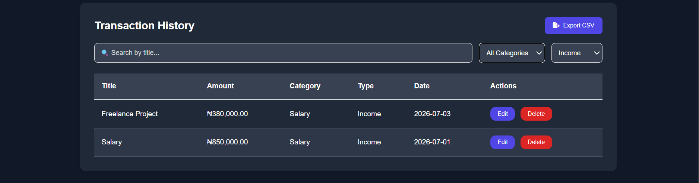

# 💰 Expense Tracker Pro

A modern personal finance web application built with **Python, Flask, SQLite, HTML, CSS, and JavaScript**. It helps users manage their income and expenses, monitor their financial balance, search and filter transactions, export data to CSV, and enjoy a responsive interface with Dark Mode support.

---

## 📸 Screenshots

### Home Dashboard



### Dark Mode



### Search Transactions



### Category Filter



### CSV Export



### transactions-table Export



### notification Export



### type-filter Export



---

## ✨ Features

- Add new income and expense transactions
- Edit existing transactions
- Delete transactions with confirmation
- Dashboard showing:
  - Total Income
  - Total Expenses
  - Current Balance
  - Total Transactions
- Search transactions by title
- Filter by category
- Filter by transaction type
- Export transactions to CSV
- Success notifications
- Delete confirmation dialog
- Responsive design
- Dark Mode
- Dark Mode preference saved using Local Storage

---

## 🛠 Technologies Used

### Backend

- Python
- Flask
- SQLite

### Frontend

- HTML5
- CSS3
- JavaScript (ES6)
- Fetch API

### Icons

- Font Awesome

---

## 📂 Project Structure

```text
Expense_Tracker_Pro/
│
├── static/
│   ├── style.css
│   └── script.js
│
├── templates/
│   └── index.html
│
├── screenshots/
│
├── app.py
├── database.py
├── expenses.db
├── requirements.txt
├── .gitignore
└── README.md
```

---

## 🚀 Installation

### Clone the repository

```bash
git clone https://github.com/YOUR_USERNAME/Expense_Tracker_Pro.git
```

### Navigate into the project

```bash
cd Expense_Tracker_Pro
```

### Create a virtual environment

```bash
python -m venv venv
```

### Activate the virtual environment

Windows

```bash
venv\Scripts\activate
```

Mac/Linux

```bash
source venv/bin/activate
```

### Install dependencies

```bash
pip install -r requirements.txt
```

### Run the application

```bash
python app.py
```

Open your browser and visit:

```
http://127.0.0.1:5000
```

---

## 📊 Dashboard

The application automatically calculates:

- Total Income
- Total Expenses
- Current Balance
- Total Number of Transactions

These values update instantly whenever a transaction is added, edited, or deleted.

---

## 📁 CSV Export

Users can export all transactions into a CSV file for record keeping or further analysis in spreadsheet applications such as Microsoft Excel.

---

## 🌙 Dark Mode

The application includes a Dark Mode feature. The selected theme is saved using Local Storage, so the user's preference is remembered after refreshing or reopening the application.

---

## 📈 Future Improvements

- Monthly analytics dashboard
- Charts and graphs
- User authentication
- Budget planning
- Recurring transactions
- Multiple user accounts
- PDF export
- Cloud database integration

---

## 👩‍💻 Author

**Favour Chinonyerem Ozomagbo**

GitHub: https://github.com/favourozomagbo

LinkedIn: (https://www.linkedin.com/in/favour-chinonyeremnora)

---

## Live Demo

Coming Soon 🚀

## ⭐ Support

If you found this project helpful, consider giving it a ⭐ on GitHub.